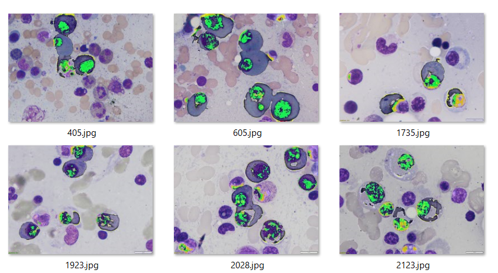
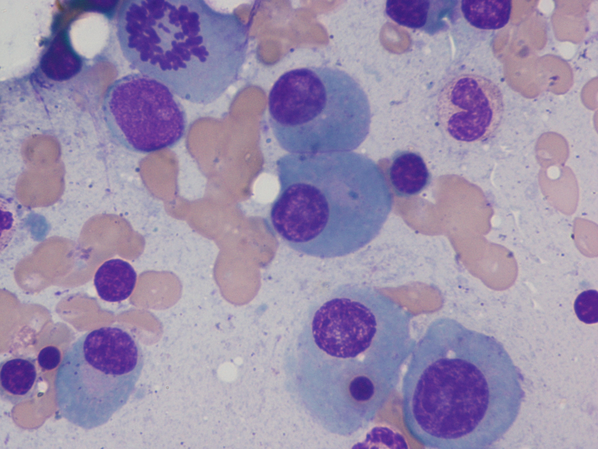
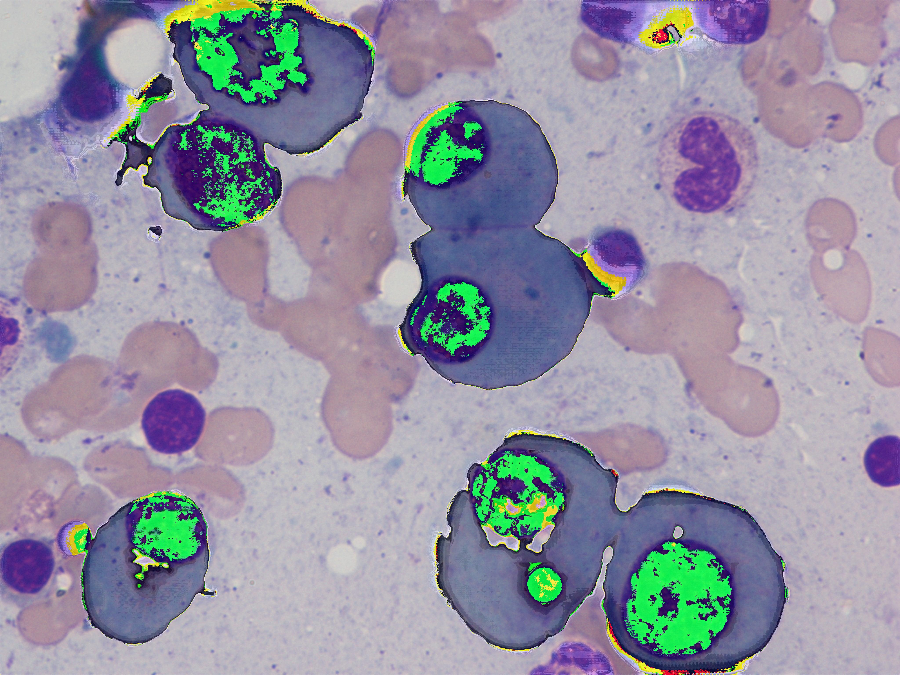
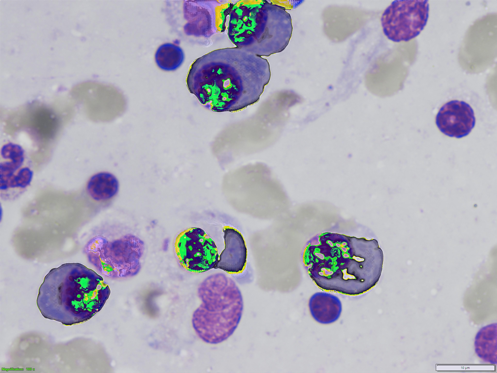
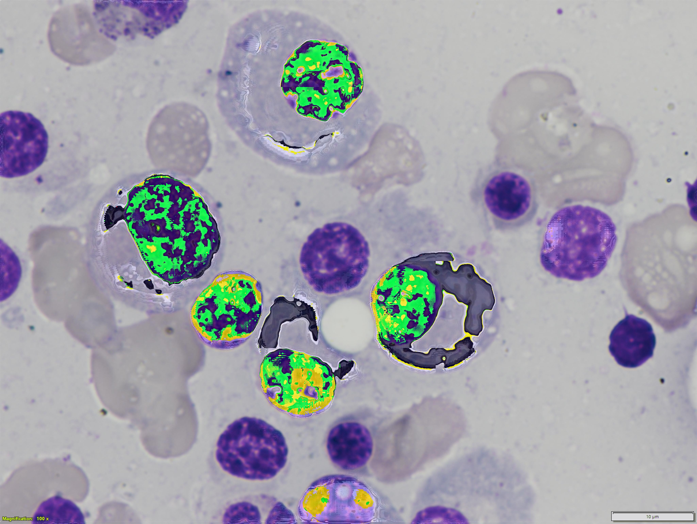

<h2>Tensorflow-Tiled-Image-Segmentation-MultipleMyeloma(2024/03/06)</h2>

This is the second experimental Tiled-Image Segmentation project for MultipleMyeloma based on
the <a href="https://github.com/sarah-antillia/Tensorflow-Image-Segmentation-API">Tensorflow-Image-Segmentation-API</a>, and
<a href="https://drive.google.com/file/d/1QiGah4_0yY-5B7s2kIZ2AjbEVu2ejB3G/view?usp=sharing">MultipleMyeloma-ImageMask-Dataset_V2_X.zip</a>
 
 

 
 
Please see our first experiment  
<a href="https://github.com/atlan-antillia/Tiled-Image-Segmentation-Multiple-Myeloma">Tiled-Image-Segmentation-Multiple-Myeloma</a>
 
 
<li>2024/03/05: Modified <a href="./src/TensorflowUNet.py">TensorflowUNet.py</a> to support bitwise_blending in infer_tiles method.</li>
 

<b>
Bitwise_blended_tiled_segmentation = Non_tiled_segmentation + Tiled_segmentation 
</b>
 
<b>Bitwise_blended_tiled_segmentation</b> image is created by applying Bitwise-AND operation to <b>Non_tiled_segmentation</b> and
<b>Tiled_segmentation</b> images. 
<b>Example of bitwise_blending </b> 
 

 

<h3>1. Dataset Citation</h3>
The original dataset used here has been take from the following  web site:  
<b>SegPC-2021-dataset</b> 
SegPC-2021: Segmentation of Multiple Myeloma Plasma Cells in Microscopic Images 
<pre>
https://www.kaggle.com/datasets/sbilab/segpc2021dataset
</pre>

<b>Citation:</b> 

<pre>
Anubha Gupta, Ritu Gupta, Shiv Gehlot, Shubham Goswami, April 29, 2021, "SegPC-2021: Segmentation of Multiple Myeloma Plasma Cells 
in Microscopic Images", IEEE Dataport, doi: https://dx.doi.org/10.21227/7np1-2q42.

BibTex
@data{segpc2021,
doi = {10.21227/7np1-2q42},
url = {https://dx.doi.org/10.21227/7np1-2q42},
author = {Anubha Gupta; Ritu Gupta; Shiv Gehlot; Shubham Goswami },
publisher = {IEEE Dataport},
title = {SegPC-2021: Segmentation of Multiple Myeloma Plasma Cells in Microscopic Images},
year = {2021} }

IMPORTANT:
If you use this dataset, please cite below publications-
1. Anubha Gupta, Rahul Duggal, Shiv Gehlot, Ritu Gupta, Anvit Mangal, Lalit Kumar, Nisarg Thakkar, and Devprakash Satpathy, 
 "GCTI-SN: Geometry-Inspired Chemical and Tissue Invariant Stain Normalization of Microscopic Medical Images," 
 Medical Image Analysis, vol. 65, Oct 2020. DOI: 
 (2020 IF: 11.148)
2. Shiv Gehlot, Anubha Gupta and Ritu Gupta, 
 "EDNFC-Net: Convolutional Neural Network with Nested Feature Concatenation for Nuclei-Instance Segmentation,"
 ICASSP 2020 - 2020 IEEE International Conference on Acoustics, Speech and Signal Processing (ICASSP), 
 Barcelona, Spain, 2020, pp. 1389-1393.
3. Anubha Gupta, Pramit Mallick, Ojaswa Sharma, Ritu Gupta, and Rahul Duggal, 
 "PCSeg: Color model driven probabilistic multiphase level set based tool for plasma cell segmentation in multiple myeloma," 
 PLoS ONE 13(12): e0207908, Dec 2018. DOI: 10.1371/journal.pone.0207908

License
CC BY-NC-SA 4.0
</pre>

<h3>
<a id="2">
2 MultipleMyeloma ImageMask Dataset
</a>
</h3>
 If you would like to train this MultipleMyelomaSegmentation model by yourself,
 please download this dataset from the google drive 
<a href="https://drive.google.com/file/d/1QiGah4_0yY-5B7s2kIZ2AjbEVu2ejB3G/view?usp=sharing">MultipleMyeloma-ImageMask-Dataset_V2_X.zip</a>
 
On that dataset, please see also <a href="https://github.com/sarah-antillia/MultipleMyeloma-ImageMask-Dataset">MultipleMyeloma-ImageMask-Dataset</a>
 
Please expand the downloaded ImageMaskDataset and place them under <b>./dataset</b> folder to be

<pre>
./dataset
└─MultipleMyeloma
    ├─test
    │  ├─images
    │  └─masks
    ├─train
    │  ├─images
    │  └─masks
    └─valid
        ├─images
        └─masks
</pre>
 
 
<b>MultipleMyelomaDataset Statistics</b> 
 

As shown above, the number of images of train and valid dataset is not necessarily large. 
Please see also our online data augmentation experiment  
<a href="https://github.com/sarah-antillia/Tensorflow-Image-Segmentation-Augmented-MultipleMyeloma">Tensorflow-Image-Segmentation-Augmented-MultipleMyeloma</a>
 

 

<h3>
<a id="3">
3 TensorflowSlightlyFlexibleUNet
</a>
</h3>
This <a href="./src/TensorflowUNet.py">TensorflowUNet</a> model is slightly flexibly customizable by a configuration file. 
For example, <b>TensorflowSlightlyFlexibleUNet/MultipleMyeloma</b> model can be customizable
by using <a href="./projects/TensorflowSlightlyFlexibleUNet/Augmented-MultipleMyeloma/train_eval_infer.config">train_eval_infer.config</a>
 
<pre>
; train_eval_infer.config
; 2024/03/01 antillia.com
; Added the following setting to [train] section, 
; , which enables to add learning_rate_reducer callback if True.
;learning_rate_reducer = True
; Added the following setting to [model] section
; activation     = "mish"

[model]
; Specify a className of UNetModel
model          ="TensorflowUNet"
image_width    = 512
image_height   = 512
image_channels = 3
num_classes    = 1
activation     = "mish"
base_filters   = 16
;num_layers     = 6
num_layers     = 7
base_kernels   = (5,5)
dropout_rate   = 0.02
clipvalue      = 0.5
learning_rate  = 0.0001
dilation       = (2,2)
;loss           = "bce_iou_loss"
loss           = "bce_dice_loss"
metrics        = ["binary_accuracy"]
show_summary   = False

;Please specify a claSss name of your ImageDataset.
;datasetclass  = "BaseImageMaskDataset"

[train]
epochs        = 100
batch_size    = 4
patience      = 10
metrics       = ["binary_accuracy", "val_binary_accuracy"]
model_dir     = "./models"
eval_dir      = "./eval"

image_datapath = "../../../dataset/MultipleMyeloma/train/images/"
mask_datapath  = "../../../dataset/MultipleMyeloma/train/masks/"
create_backup  = True

; 2024/03/01 
learning_rate_reducer = True
reducer_patience      = 5

[eval]
;image_datapath = "../../../dataset/MultipleMyeloma/valid/images/"
;mask_datapath  = "../../../dataset/MultipleMyeloma/valid/masks/"
image_datapath = "../../../dataset/MultipleMyeloma/test/images/"
mask_datapath  = "../../../dataset/MultipleMyeloma/test/masks/"

[infer] 
images_dir = "./4k_mini_test"
output_dir = "./4k_mini_test_output"

[tiledinfer] 
overlapping = 64
split_size  = 512
images_dir = "./4k_mini_test"
output_dir = "./4k_tiled_mini_test_output"
merged_dir  = "./4k_tiled_mini_test_output_merged"

[mask]
blur      = True
blur_size = (3,3)
binarize  = True
;threshold = 60
threshold =160

</pre>

Please note that we have updated <a href="./src/TensorflowUNet.py">TensorflowUNet.py</a> to be able to specify <b>mish</b> as an 
activation function in this configuration file as shown below. 
<pre>
[model]
activation     = "mish"    
</pre>
The definition of mish is quite simple as shown below. 
<pre>
# Please see: https://github.com/digantamisra98/Mish/blob/master/Mish/TFKeras/mish.py
def mish(x):
  x = tf.convert_to_tensor(x) #Added this line
  return tf.math.multiply(x, tf.math.tanh(tf.math.softplus(x)))
</pre>

Furthermore, we have added the following parameters to enable <b>learning_rate_reducer</b> callback in the training process of this 
TensorflowUNet model.
<pre>
[train]
learning_rate_reducer = True
reducer_patience      = 5
</pre>
If learning_rate_reducer is True, the following callback will be added to a callbacks list. 
<pre>
reducer = ReduceLROnPlateau(
           monitor = 'val_loss',
           factor  = 0.1,
           patience= lr_patience,
           min_lr  = 0.0)
</pre>

 
<h3>
3.1 Training
</h3>
Please move to a <b>./projects/TensorflowSlightlyFlexibleUNet/MultipleMyeloma</b> folder, 
and run the following bat file to train TensorflowUNet model for MultipleMyeloma. 
<pre>
./1.train.bat
</pre>
, which simply runs <a href="./src/TensorflowUNetTrainer.py">TensorflowUNetTrainer.py </a>
in the following way.

<pre>
python ../../../src/TensorflowUNetTrainer.py ./train_eval_infer.config
</pre>
Train console output: 
 
 
Train metrics: 
 
 
Train losses: 
 
 
<h3>
3.2 Evaluation
</h3>
Please move to a <b>./projects/TensorflowSlightlyFlexibleUNet/Augmented-MultipleMyeloma</b> folder, 
and run the following bat file to evaluate TensorflowUNet model for MultipleMyeloma. 
<pre>
./2.evaluate.bat
</pre>
, which simply runs <a href="./src/TensorflowUNetEvaluator.py">TensorflowUNetEvaluator.py </a>
in the following way.

<pre>
python ../../../src/TensorflowUNetEvaluator.py ./train_eval_infer.config
</pre>
This evalutes loss and accuray for test dataset specified [eval] section. 
<pre>
[eval] 
image_datapath = "../../../dataset/MultipleMyeloma/test/images/"
mask_datapath  = "../../../dataset/MultipleMyeloma/test/masks/"
</pre>
Evaluation console output: 

 
As shown above, the loss score is not enough low. 
<pre>
Test loss    :0.3172
Test accuracy:0.9239000082015991
</pre>
Apparently, this is a worse score than that of the  
<a href="https://github.com/sarah-antillia/Tensorflow-Image-Segmentation-Augmented-MultipleMyeloma">Tensorflow-Image-Segmentation-Augmented-MultipleMyeloma</a>. 
<pre>
Test loss    :0.1865
Test accuracy:0.9589999914169312
</pre>
 
<h2>
3.3 Inference
</h2>
Please move to a <b>./projects/TensorflowSlightlyFlexibleUNet/MultipleMyeloma</b> folder 
,and run the following bat file to infer segmentation regions for images by the Trained-TensorflowUNet model for MultipleMyeloma. 
<pre>
./3.infer.bat
</pre>
, which simply runs <a href="./src/TensorflowUNetInferencer.py">TensorflowUNetInferencer.py</a>
in the following way.

<pre>
python ../../../src/TensorflowUNetInferencer.py ./train_eval_infer_aug.config
</pre>
4k_mini test images 
 
<!--
Sample test mask (ground_truth) 
 
-->

 
Inferred 4k_mini_test masks 
 
 
This inference result is slightly different from that of the online-augmentation experiment 
<a href="https://github.com/sarah-antillia/Tensorflow-Image-Segmentation-Augmented-MultipleMyeloma">Tensorflow-Image-Segmentation-Augmented-MultipleMyeloma</a>. 
 

<h2>
3.4 Tiled-Inference
</h2>
Please move to a <b>./projects/TensorflowSlightlyFlexibleUNet/MultipleMyeloma</b> folder 
,and run the following bat file to infer segmentation regions for images by the Trained-TensorflowUNet model for MultipleMyeloma. 
<pre>
./4.tiled_infer.bat
</pre>
, which simply runs <a href="./src/TensorflowUNetTiledInferencer.py">TensorflowUNetTiledInferencer.py</a>
in the following way.

<pre>
python ../../../src/TensorflowUNetTiledInferencer.py ./train_eval_infer.config
</pre>
4k_mini test images 
 
<!--
Sample test mask (ground_truth) 
 
-->

 
Inferred 4k_tiled_mini_test masks 
 
 
Inferred 4k_tiled_mini_test_output_merged 
 
 
 
Enlarged samples 
<table>

<tr>
<td>
mini_test/605.jpg 

</td>
<td>
Inferred merged/605.jpg 

</td> 
</tr>

<tr>
<td>
mini_test/1735.jpg 

</td>
<td>
Inferred merged/1735.jpg 

</td> 
</tr>

<tr>
<td>
mini_test/1923.jpg 

</td>
<td>
Inferred merged/1923.jpg 

</td> 
</tr>

<tr>
<td>
mini_test/2123.jpg 

</td>
<td>
Inferred merged/2123.jpg 

</td> 
</tr>

<tr>
<td>
mini_test/2405.jpg 

</td>
<td>
Inferred merged/2123.jpg 

</td> 
</tr>

</table>

<h3>
References
</h3>
<b>1. SegPC-2021-dataset</b> 
SegPC-2021: Segmentation of Multiple Myeloma Plasma Cells in Microscopic Images 
<pre>
https://www.kaggle.com/datasets/sbilab/segpc2021dataset
</pre>
Citation: 
<pre>
Anubha Gupta, Ritu Gupta, Shiv Gehlot, Shubham Goswami, April 29, 2021, "SegPC-2021: Segmentation of Multiple Myeloma Plasma Cells 
in Microscopic Images", IEEE Dataport, doi: https://dx.doi.org/10.21227/7np1-2q42.
BibTex
@data{segpc2021,
doi = {10.21227/7np1-2q42},
url = {https://dx.doi.org/10.21227/7np1-2q42},
author = {Anubha Gupta; Ritu Gupta; Shiv Gehlot; Shubham Goswami },
publisher = {IEEE Dataport},
title = {SegPC-2021: Segmentation of Multiple Myeloma Plasma Cells in Microscopic Images},
year = {2021} }
IMPORTANT:
If you use this dataset, please cite below publications-
1. Anubha Gupta, Rahul Duggal, Shiv Gehlot, Ritu Gupta, Anvit Mangal, Lalit Kumar, Nisarg Thakkar, and Devprakash Satpathy, 
 "GCTI-SN: Geometry-Inspired Chemical and Tissue Invariant Stain Normalization of Microscopic Medical Images," 
 Medical Image Analysis, vol. 65, Oct 2020. DOI: 
 (2020 IF: 11.148)
2. Shiv Gehlot, Anubha Gupta and Ritu Gupta, 
 "EDNFC-Net: Convolutional Neural Network with Nested Feature Concatenation for Nuclei-Instance Segmentation,"
 ICASSP 2020 - 2020 IEEE International Conference on Acoustics, Speech and Signal Processing (ICASSP), 
 Barcelona, Spain, 2020, pp. 1389-1393.
3. Anubha Gupta, Pramit Mallick, Ojaswa Sharma, Ritu Gupta, and Rahul Duggal, 
 "PCSeg: Color model driven probabilistic multiphase level set based tool for plasma cell segmentation in multiple myeloma," 
 PLoS ONE 13(12): e0207908, Dec 2018. DOI: 10.1371/journal.pone.0207908
License
CC BY-NC-SA 4.0
</pre>

<b>2. Deep Learning Based Approach For MultipleMyeloma Detection</b> 
Vyshnav M T, Sowmya V, Gopalakrishnan E A, Sajith Variyar V V, Vijay Krishna Menon, Soman K P 
<pre>
https://www.researchgate.net/publication/346238471_Deep_Learning_Based_Approach_for_Multiple_Myeloma_Detection
</pre>
 

<b>3. Image-Segmentation-Multiple-Myeloma</b> 
Toshiyuki Arai @antillia.com 
<pre>
https://github.com/atlan-antillia/Image-Segmentation-Multiple-Myeloma
</pre>
 

<b>4. Tensorflow-Image-Segmentation-Augmented-MultipleMyeloma</b> 
Toshiyuki Arai @antillia.com 
<pre>
https://github.com/sarah-antillia/Tensorflow-Image-Segmentation-Augmented-MultipleMyeloma
</pre>
 

